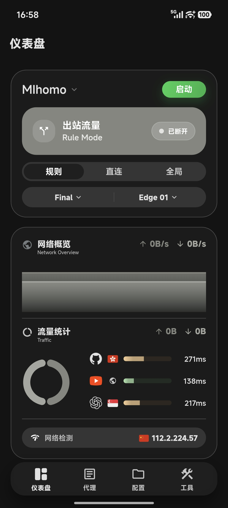
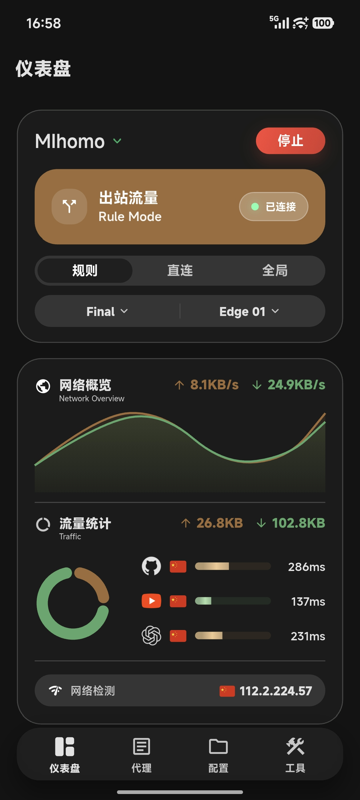
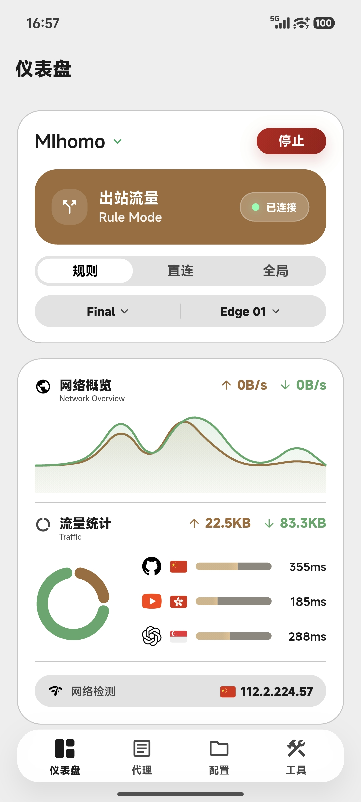
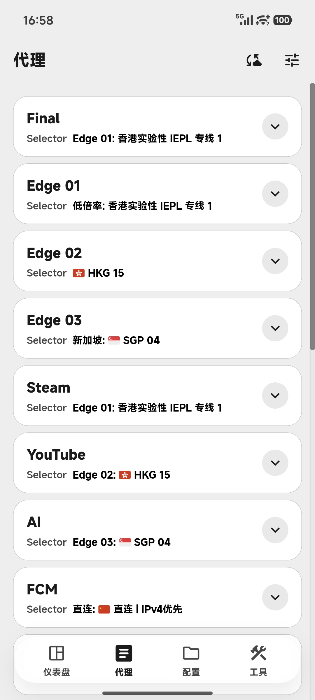
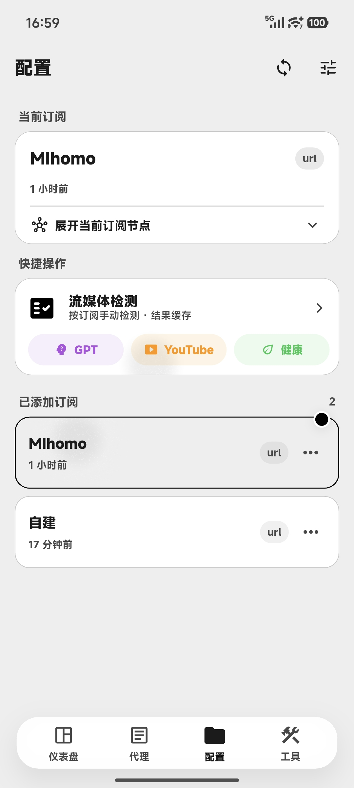
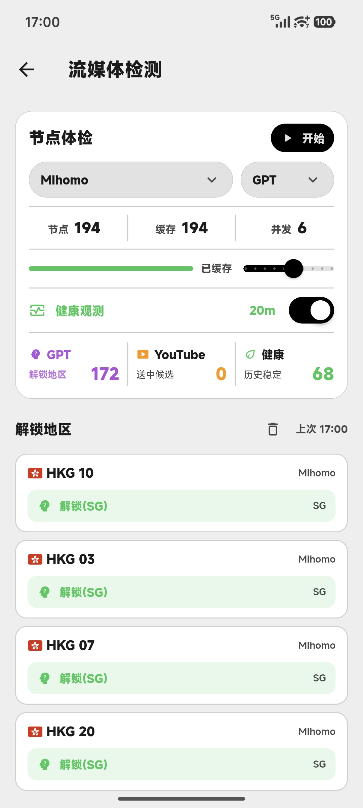
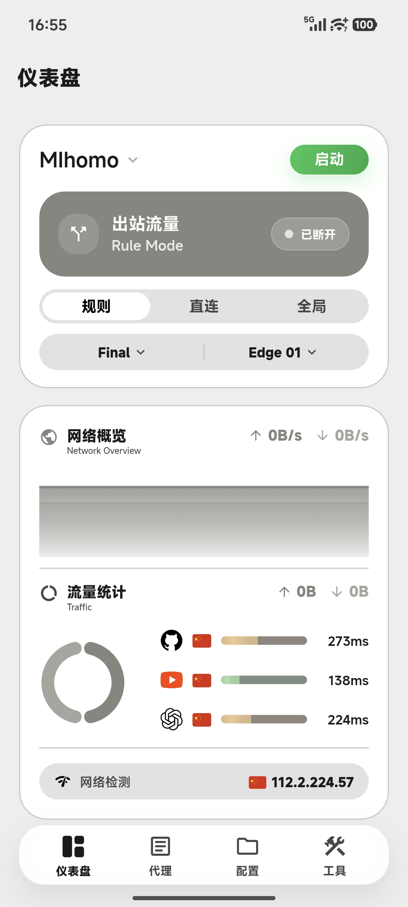
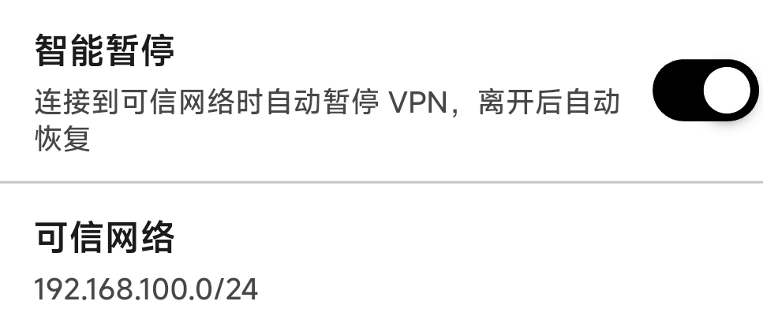
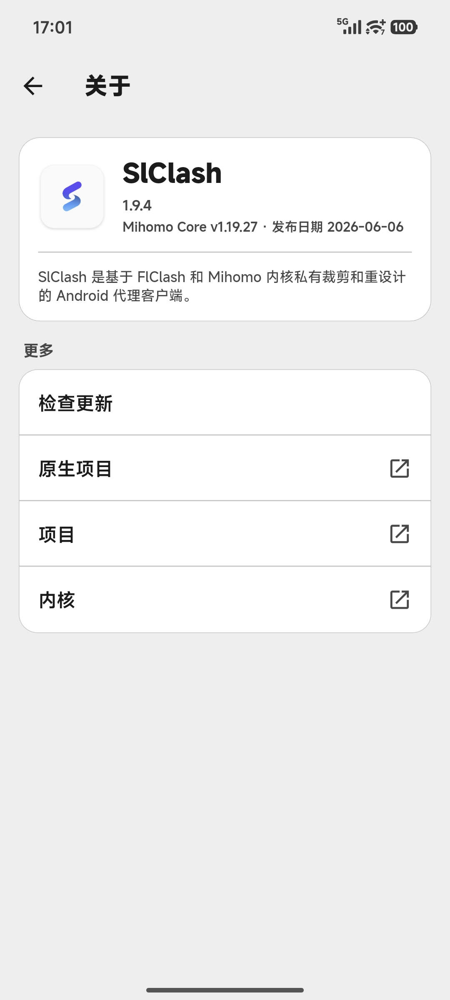

# SlClash

SlClash 是基于 [FlClash](https://github.com/chen08209/FlClash) 和 [Mihomo](https://github.com/MetaCubeX/mihomo) 内核裁剪、重设计的 Android 代理客户端。

这个项目长期面向个人自用场景：只做 Android，只保留 `arm64-v8a`，重点放在手机端的视觉体验、日常使用效率、后台消耗控制和几个自己确实需要的功能上。

## 界面预览

截图来自实际 Android 设备运行界面，节点名称、IP 和检测结果仅作为展示示例。

  
  
  

  
  
  

  
  
  

## UI 设计

SlClash 不是在原项目上简单换一套颜色，而是按 Android 手机的日常使用重新整理过的界面。

它保留代理客户端需要的信息密度，但把启动、暂停、恢复、模式切换、订阅选择、策略组选择、流量观察这些高频操作放到更顺手的位置。仪表盘使用大卡片、状态色、图表和底部导航组织信息，启动、暂停、连接、恢复这些状态不用进菜单就能看明白。

项目内置多套视觉风格：浅色、深色、纯黑、动态色和自定义主题色都做了适配。不同主题不是简单反色，而是重新处理卡片层级、边框、填充、按钮、图表、底部导航和系统栏颜色，让黑白两套环境都保持统一的观感。

代理、配置、资源、流媒体检测、关于页面也统一重做了移动端布局：大字号标题、卡片式分组、底部弹层、清晰的触控区域和更少的视觉噪音。它仍然是一个代理工具，但不希望看起来像临时拼起来的工程面板。

## 轻量、省电与流畅

SlClash 的优化重点不是堆功能，而是减少手机上不必要的常驻负担。

- 只保留 Android 和 `arm64-v8a`，移除了桌面平台、系统托盘、桌面热键、桌面系统代理、Rust IPC、分发器打包等与手机无关的链路。
- 前后台刷新做了收敛：连接列表只在应用前台且当前页面可见时刷新；首页延迟探测会根据页面可见性、运行状态和自动刷新开关启停；状态切换和网络检测有防抖保护。
- 高频数据做了克制处理：日志、请求记录使用固定长度缓存和节流更新，避免大量事件持续触发界面重绘；连接、请求、日志这些页面尽量按需刷新，不把所有实时数据都变成全局高频 UI 任务。
- 网络切换时会更新本地 IP，并按设置清理陈旧连接，同时限制短时间重复触发，减少 Wi-Fi / 5G 来回切换时的额外开销。
- 智能暂停使用可信 IP / CIDR 网络判断，在 Android 上优先通过原生 `smartStop` / `smartResume` 暂停和恢复 TUN，不必每次都完整销毁和重启服务。
- 健康观测使用独立调度、并发上限、失败重试、结果缓存和慢节点冷却策略，尽量让后台检测只做有意义的工作。
- 保留低内存 Geo 加载、只统计代理流量等设置项，适合长期放在手机上使用。

## 特色功能

### 流媒体检测

内置 GPT、YouTube 和健康检测三种模式，手动选择一个订阅和一个检测模式后执行，不会在打开页面时自动跑检测。

- GPT、YouTube、健康模式相互独立，健康模式只做延迟 / HTTPS 健康采样，不混入解锁检测。
- 检测结果按模式缓存，清理某一种模式不会影响同一节点的其他结果。
- 支持从运行时数据中解析真实叶子节点，包含 provider 下载节点，不只依赖静态配置搜索。
- 自动健康观测可以复用同一套缓存，并对连续超时、高延迟节点做冷却，避免反复浪费检测次数。
- 结果文案保持短而直接，例如 `GPT`、`YouTube`、`解锁(US)`、`阻断`、`超时`、`健康`。

### 智能暂停

连接到可信网络时自动暂停 VPN，离开后自动恢复。可信网络支持 IP 和 CIDR 网段，适合家里、公司、旁路由等不需要手机代理常驻的环境。

智能暂停带有防抖、手动恢复保护和重复点击保护。用户在可信网络中手动恢复后，本次网络会话内不会马上再次自动暂停，避免和用户操作互相抢状态。

### 订阅、代理与资源管理

- 代理页围绕移动端手势和阅读习惯重排，支持代理组展开、当前节点选择、单节点延迟和整组延迟测试。
- 配置页支持查看当前订阅节点，提供更直接的订阅入口和流媒体检测入口。
- 资源页支持 GEOIP、GEOSITE、MMDB、ASN 等资源更新，并提供关闭、每日、三日、七日等自动更新频率。
- 网络概览可以查看实时速率、流量曲线、常用站点延迟和路由国家提示。
- 节点切换、网络切换、连接清理、流量统计等常用行为都尽量围绕手机端高频操作做了简化。

## 项目边界

SlClash 会长期以个人自用实现为主，不计划做通用多平台客户端，也不计划重新引入桌面端能力。

本项目不会涉及应用市场分发、商业化运营或跨平台包装。任何人都可以在许可证范围内 fork、裁剪、改 UI、改功能，做成更适合自己的版本。

当前边界：

- 仅支持 Android。
- 仅支持 `arm64-v8a`。
- 不维护 Windows、macOS、Linux、系统托盘、桌面热键、桌面系统代理、桌面插件和发行版打包。

## 获取

发布包见 [GitHub Releases](https://github.com/songzhengpei/Slclash/releases)。

如果需要自行构建，请先阅读仓库内的 `AGENTS.md` 和 `dev-env.bat`。README 不再展开本地 SDK 路径和构建细节。

## 致谢

SlClash 基于 [FlClash](https://github.com/chen08209/FlClash) 的项目基础和 [Mihomo](https://github.com/MetaCubeX/mihomo) 内核生态继续裁剪与重设计。

感谢原项目和 Mihomo / Clash.Meta 社区提供的基础能力。本仓库只是一个围绕个人 Android 使用习惯长期打磨的分支。
