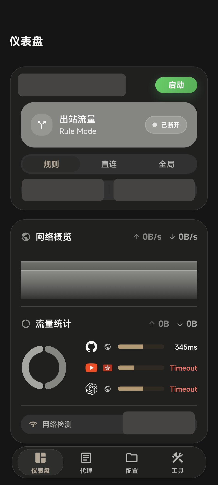
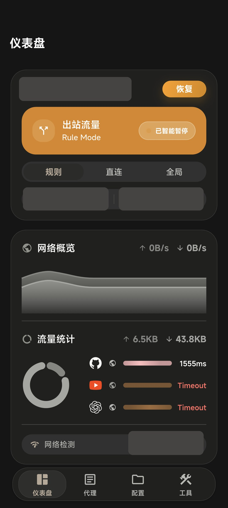
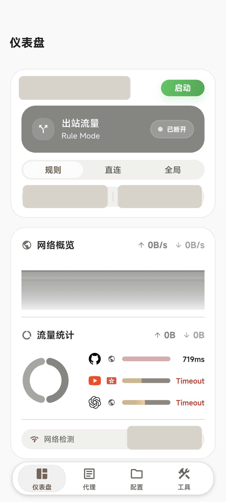
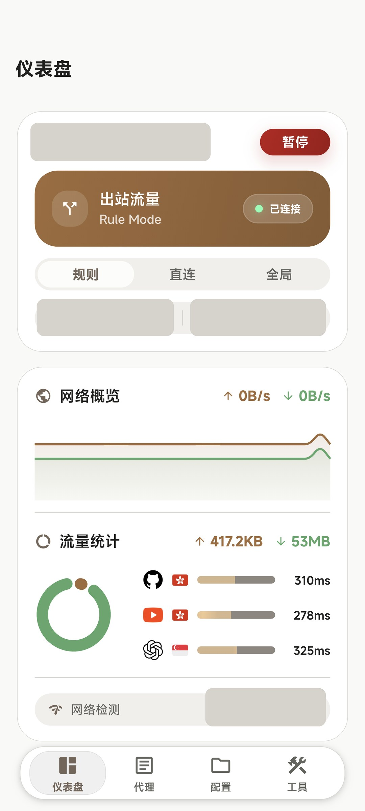
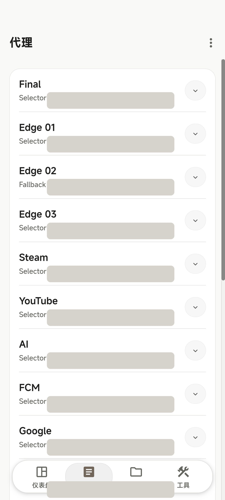
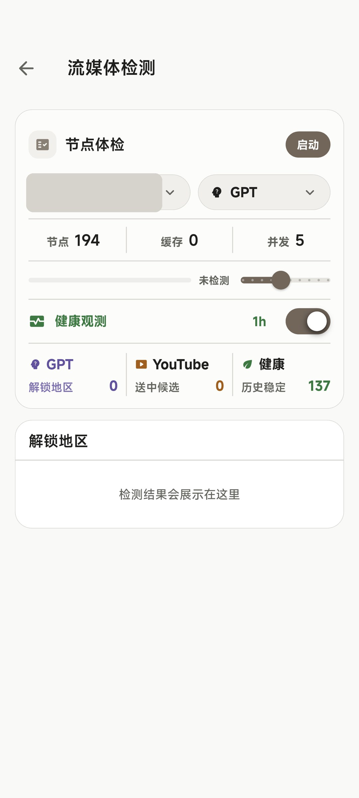
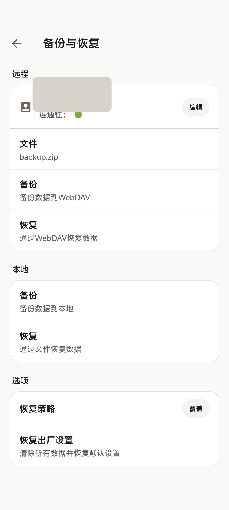
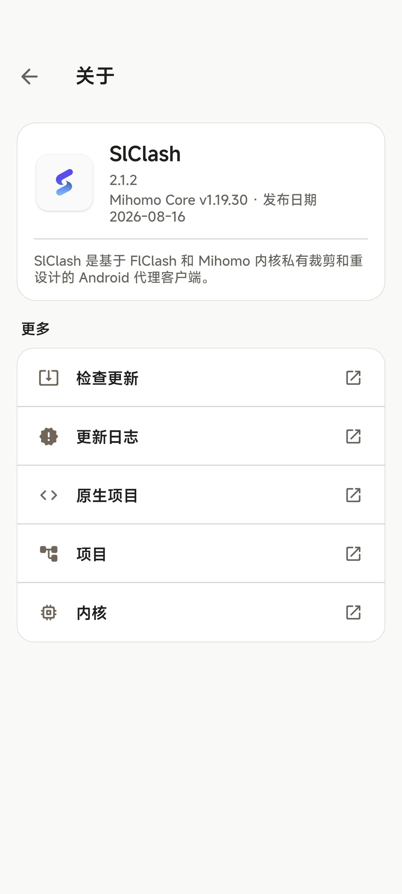
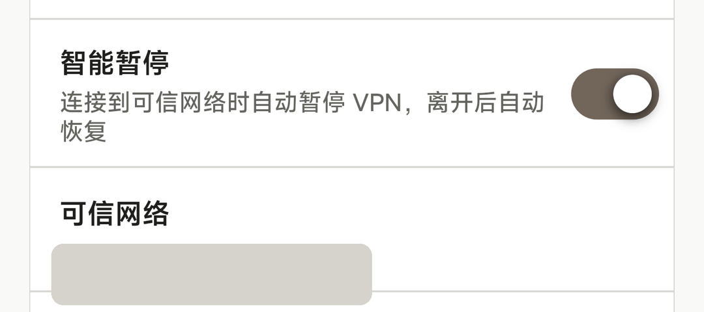

  <a href="README.md">简体中文</a> · <strong>English</strong>

# SlClash

SlClash is an Android proxy client built by continuously trimming and redesigning [FlClash](https://github.com/chen08209/FlClash) around the [Mihomo](https://github.com/MetaCubeX/mihomo) core.

It supports Android only and ships only for `arm64-v8a`. The goal is not to put another shell around Mihomo, but to build a mobile client we are willing to rely on every day—one that treats performance, lifecycle behavior, and small interaction details as product work.

## Our mission around Mihomo

SlClash exists to carry Mihomo's full semantics reliably onto Android, not to invent a private, simplified proxy language on top of the core.

Mihomo configurations, providers, proxy groups, rules, and runtime state are both the source of capability and the source of truth. The interface can be more approachable on a phone, but simplifying the UI must not silently change what an existing Mihomo configuration means or move it into an incompatible dialect.

That mission also defines the project's boundaries:

- Mihomo owns proxy execution, rules, and configuration semantics. SlClash owns the Android experience, lifecycle, performance, subscription workflows, and observability around them.
- Faithfully carrying Mihomo semantics is the long-term direction. We do not claim that every capability Mihomo may add in the future is automatically and immediately covered in full.
- The project supports only Android and `arm64-v8a`. It will not rebuild Windows, macOS, Linux, system tray, desktop hotkey, desktop system proxy, or distributor packaging features.
- The Unified Subscription Center is a subscription organization, migration, and recovery layer. It does not replace or alter Mihomo's core semantics.

## Maintenance and feedback

SlClash is actively maintained. Reports from real devices—especially stability, compatibility, and everyday usability issues—are the feedback we value most.

Please use [GitHub Issues](https://github.com/songzhengpei/Slclash/issues) or email [nudymanu@gmail.com](mailto:nudymanu@gmail.com). Clear defects and experience problems will continue to be fixed. Feature requests are evaluated case by case against Mihomo semantic consistency, the Android-only scope, ongoing maintenance cost, and actual need.

## Why we keep maintaining this client

Android already has many Mihomo-based clients, but a crowded field does not automatically produce a carefully crafted one. We still want a client we can trust for years: proxy changes should converge reliably, startup should feel responsive, background work should remain restrained, memory and battery use should stay reasonable, and the interface should hold up to daily use.

SlClash therefore does not measure progress by feature count. Performance, battery efficiency, and memory discipline are features themselves. An unnecessary refresh, an unbounded background task, or stale state after a network transition is a product issue—not an optional cleanup item.

## Interface

These screenshots come from a production Android build running on a real device. IP addresses, subscriptions, nodes, providers, accounts, and device-related details have been irreversibly redacted with solid masks.

  
  
  

  
  
  

  
  
  

  
  

  

## Unified Subscription Center: subscriptions should not be trapped behind one endpoint

A subscription is not always a URL that remains stable for years. Ephemeral or one-time links, several commercial providers, self-hosted nodes, external providers, and endpoints that frequently change or expire often coexist. Once those sources are scattered across phones, desktops, and separate backups, organizing, migrating, and recovering them becomes increasingly expensive.

The Unified Subscription Center was designed for that reality. It turns sources with different lifetimes and formats into one recoverable subscription collection. An archive produced by the center can be imported directly as subscriptions through SlClash's restore flow. Together with Clash Verge Rev backup compatibility, this creates a migration and backup path between SlClash, Clash Verge Rev, and the Unified Subscription Center.

The center is still being refined and will be open-sourced when it is ready. There is no promised date; format stability, recovery behavior, and cross-client compatibility come first.

## Why Clash Verge Rev backup compatibility matters

A phone and a desktop should not require two isolated copies of the same subscriptions. SlClash can import subscription backups from Clash Verge Rev, while SlClash's exported subscription package can be imported back into Clash Verge Rev, enabling two-way migration.

WebDAV backups follow Clash Verge Rev's existing `/clash-verge-rev-backup` directory convention so that cross-client backups share one explicit location instead of creating another isolated directory. Subscription restores update the relevant profile data while preserving SlClash settings, scripts, rules, and custom proxy groups.

## Redesigned for phones, not merely recolored

SlClash keeps the information density a proxy client needs while moving frequent actions—start, pause, resume, mode changes, subscription selection, proxy-group selection, and traffic observation—into more direct mobile interactions. The dashboard, proxy and profile pages, tools, and bottom sheets have all been reorganized around touch and phone-sized reading.

Light, dark, pure-black, dynamic, and custom themes are more than color inversion. Card hierarchy, borders, fills, state colors, charts, bottom navigation, and system bars are adjusted together. It remains a professional tool without needing to look like a temporary engineering panel.

## Performance, battery, and memory are features

Rather than advertising one attractive number that quickly becomes obsolete across devices and versions, SlClash constrains the mechanisms that create cost:

- Only Android and `arm64-v8a` remain. Desktop platforms, tray integration, desktop hotkeys and system proxy, Rust IPC, and distributor packaging paths have been removed.
- Connections, requests, logs, and dashboard probes refresh only in the pages and lifecycle states that need them. High-frequency events use bounded caches, throttling, and debouncing instead of continuously rebuilding global UI state.
- Network transitions refresh local state and clear stale connections while suppressing repeated triggers in a short window.
- Health observation uses bounded concurrency, cached results, retries, and cooldowns for slow or failing nodes.
- On trusted networks, Smart Pause prefers Android-native `smartStop` / `smartResume` to pause and restore TUN without fully destroying and rebuilding the service each time.
- A real-device Phase 4 harness audits startup, memory, navigation, proxy groups, IPC, VPN lifecycle, and background behavior. See the [performance harness documentation](tools/perf/README.md).

## Features shaped by real usage

### Smart Pause

The VPN can pause automatically on trusted home, office, or router networks identified by IP/CIDR and resume when the device leaves. Debouncing, repeated-action protection, and a session-level manual-resume override keep automatic state changes from fighting the user.

### Media and health checks

GPT, YouTube, and health checks are independent modes. Opening the page does not start a check, and running one mode does not trigger another. Results are cached per mode; health observation reuses the cache and cools down nodes that repeatedly time out or respond slowly.

Candidates come from Mihomo's actual runtime leaf-proxy data, including nodes downloaded by providers, rather than only from a static configuration search.

### Subscriptions, proxies, and resources

The proxy page supports group expansion, node selection, single-node latency, and whole-group latency checks. The profile page exposes current subscription nodes, media checks, and direct subscription management. The resource page manages GEOIP, GEOSITE, MMDB, ASN, and update schedules. Network Overview brings together live rates, traffic trends, common-site latency, and route-region hints.

## Download

Production and beta packages are available from [GitHub Releases](https://github.com/songzhengpei/Slclash/releases).

Only Android `arm64-v8a` is supported. Before building locally, read [`AGENTS.md`](AGENTS.md); personal SDK paths are intentionally kept out of this README.

## Acknowledgements

SlClash is built on the foundation of [FlClash](https://github.com/chen08209/FlClash) and the [Mihomo](https://github.com/MetaCubeX/mihomo) / Clash.Meta ecosystem.

Thank you to the original authors and communities for the core, the client foundation, and the open technical discussions. SlClash is one Android-focused branch continuing that work around a personal, long-term mobile workflow.
